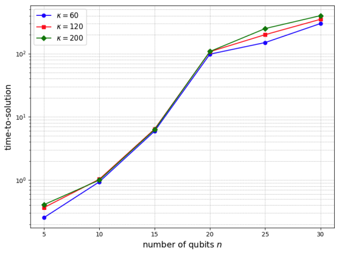
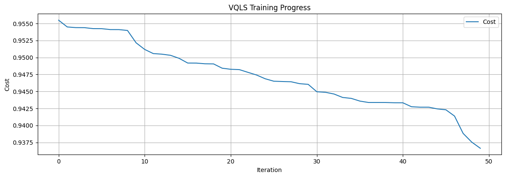
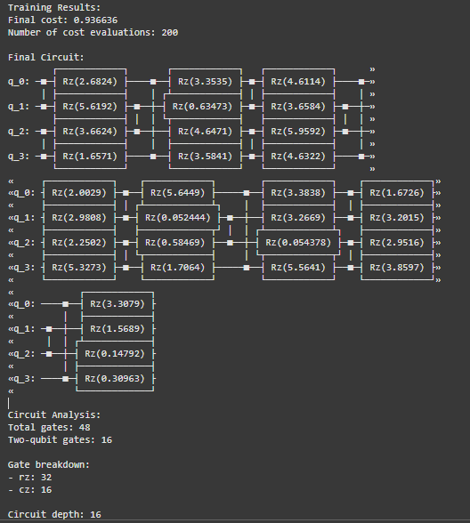

# Variational Quantum Linear Solver (VQLS)

This repository contains an implementation of a **Variational Quantum Linear Solver (VQLS)** with scaling analysis inspired by Ising models. The code integrates quantum-inspired techniques to solve linear systems, leveraging variational quantum circuits.

## Features

- **Customizable Quantum Circuits**:
  - Supports various ansatz types, including QAOA-based, hardware-efficient, and hybrid configurations.
- **Ising-inspired Linear System**:
  - Implements a Hamiltonian-based linear system with normalization parameters derived from eigenvalue bounds.
- **Scaling Analysis**:
  - Analyzes the solver's performance as a function of:
    - Condition number (κ),
    - Precision (ε),
    - Number of qubits (n).
- **Cost Function Options**:
  - Local and global cost evaluation for improved optimization flexibility.
- **Visualization**:
  - Training progress and scaling analysis plots.
  - Quantum circuit visualization using Qiskit.

## Prerequisites

The project uses the following dependencies:
- Python 3.7+
- [Qiskit](https://qiskit.org/)
- NumPy
- SciPy
- Matplotlib

You can install them via pip:

```bash
pip install qiskit numpy scipy matplotlib
```

[This is the link to the folder with the video explanation](https://drive.google.com/drive/folders/1xu_UcqyqD3Ovhe9AgvSbKnlB8unU8sjI?usp=sharing)

## Numerical analysis

Scaling behavior with respect to 𝑛 for the Ising-inspired QLSP. Curves are shown for ϵ = 0.01 and κ = 60, 120, 200. In all cases we trained the local cost CL using four layers of the Layered Hardware-Efficient Ansatz:



Additionally, we show the training of the cost function as a function of the number of optimization steps:



The breakdown of the entire module is provided in the following analysis::


